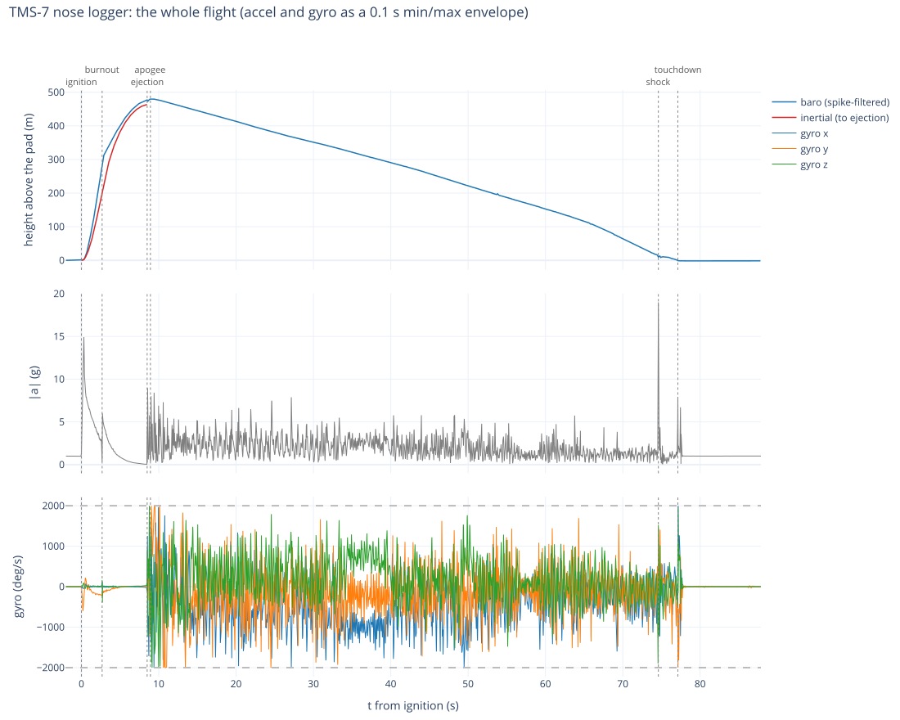
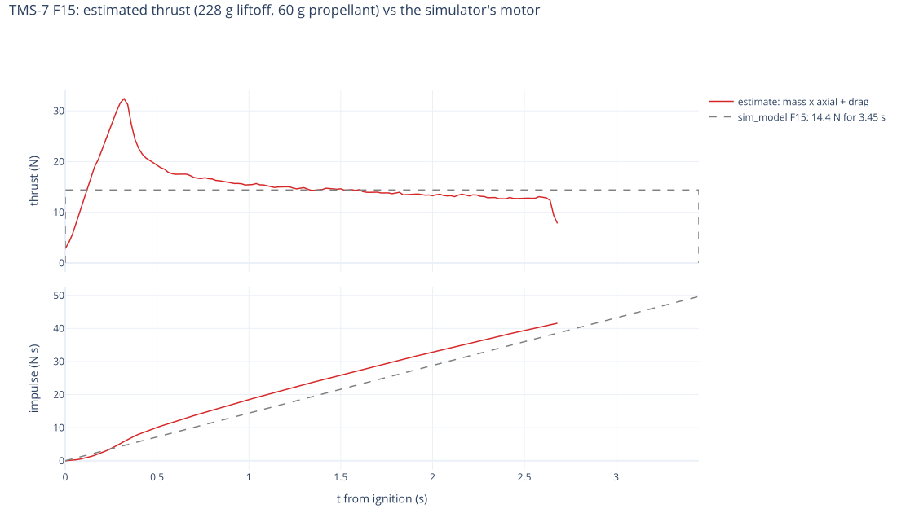
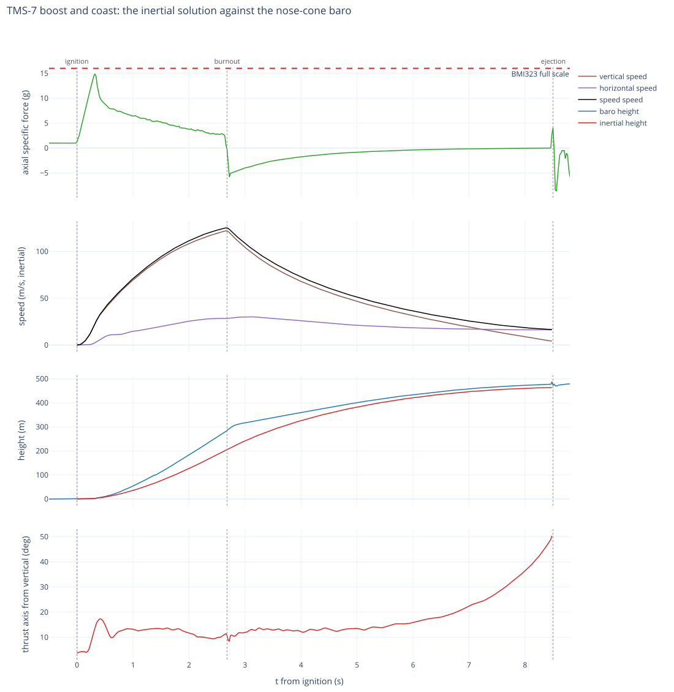
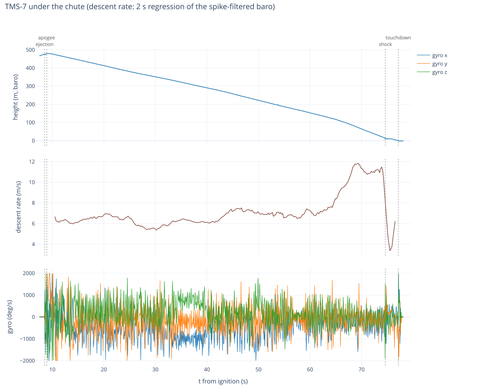
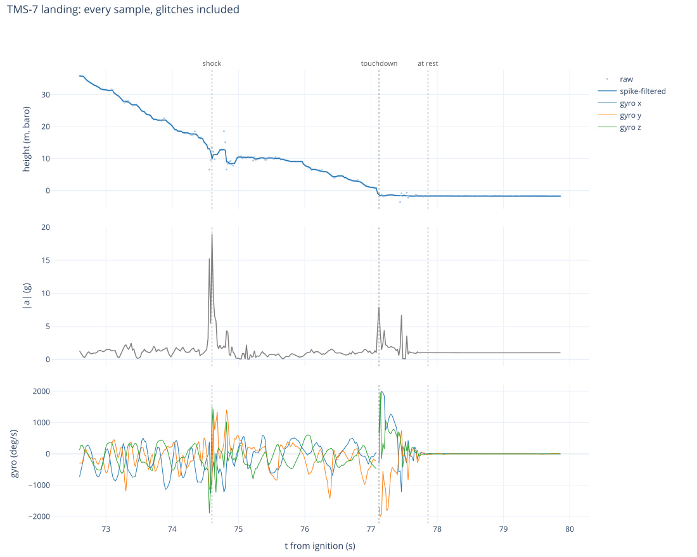

# TMS-7 — booster structural test

**No glider.** Booster only, flown to see how the new booster construction handles the strongest motor
available.

| | |
|---|---|
| assembled mass | **129.5 g** (119.5 g airframe + 10 g nose logger, without motor) |
| motor | **F15** (98.8 g loaded) |
| liftoff | **228.3 g** |
| electronics | **nose logger** — ESP32-C6 + SEN0697 + LiPo in the nose cone (`src/logger/`) |

The F15 is the point: it is the highest-impulse motor in the set (49.7 N·s against the E16's 28.5), so
this flies the worst structural case before an instrumented airframe is trusted to it. The booster's
condition afterwards is still the result that decides the test.

**The nose logger makes the flight yield numbers as well as a verdict.** It is standalone — no radio, no
link to anything — recording accel, gyro, pressure and temperature at 50 Hz to its own flash, so this
otherwise data-free flight returns **peak boost acceleration** and **apogee altitude**. It costs 10 g,
which on a chute-recovered booster buys accuracy nothing: unlike a glider, there is no landing zone to
miss.

Expected peak specific force is `25 N / (0.2283 kg × 9.81) ≈ **11.2 g**` against the BMI323's ±16 g
ceiling — 1.4× of margin, with no measured ignition transient anywhere in this project to bound the
spike. Hand punches on the bench already railed that ceiling on seven samples, so an impulsive event can
clip; a sustained boost of this size should not. If the peak must be guaranteed rather than probable, an
ADXL375 (±200 g, owned, driver written) goes in beside it.

**At recovery: switch the logger OFF.** Carrying the airframe back is motion, so it keeps recording at
full rate, and a full flash deletes the oldest segments — about 28 minutes of handling overwrites the
flight. Read it off on the bench with the procedure in `src/logger/README.md` ("Reading the logs off"):
never reflash the C6 before the logs are copied, because a reflash erases them.

## Flight — 2026-10-03: success

The booster survived the F15 and came down under its chute, and the nose logger recorded the whole
flight at 50 Hz with no gaps. TMS-7 was the lightest airframe on the strongest motor, so its numbers
are the fleet's **boundaries**: no 10-03 airframe on an F15 accelerates, flies or climbs harder than
this.



| | measured | how |
|---|---|---|
| thrust axis on the pad | **3.7°** from vertical; the velocity on the rod says ~1.5° for the rod itself, so the logger sits a few degrees off the airframe axis | pad gravity vs the thrust axis |
| peak acceleration | **14.9 g** at 0.32 s, **93 %** of the BMI323's ±16 g | accelerometer, along the thrust axis |
| leaving the rod | 12.7 m/s after 1 m, 20.0 m/s after 2 m | inertial |
| burnout | **2.68 s** (thrust falls below drag) | accelerometer |
| top speed | **125 m/s, Mach 0.36**, at burnout: 122 m/s up, 28 m/s sideways | inertial |
| tilt | ~12° through the burn; ~50° at ejection | gyro |
| ejection | **8.50 s**, 0.4–0.6 s before apogee, still climbing at 4.4 m/s, 166 m downrange | accelerometer + inertial |
| apogee | **464 m** inertial at 8.9 s / **479 m** baro at 9.1 s (471 m if the air was 30 °C) | both; the truth lies between |
| descent | 6.1–6.9 m/s from apogee down to ~150 m, then **9–12 m/s** | baro: 10 s bands; 2 s regression for the 11.8 m/s peak |
| landing | 19.0 g shock at 74.6 s ~12 m above the pad; touchdown **77.1 s**; at rest 77.9 s | all |
| motor (estimate) | peak **32 N**, **42 N·s** over 2.68 s, 15.6 N average | mass × axial force + drag |

Inertial = strapdown integration of the logger's gyro and accelerometer from the pad up to the ejection
(`src/logger/flight.py`). The baro is used only where the airframe is slow, for the reason in finding 3.

### What it says

**1. The boost used 93 % of the accelerometer's range; the plan was 70 %.** The README above predicted
11.2 g from a 25 N peak. The F15 actually spikes to ~32 N at 0.3 s, by which time ~8 g of propellant is
gone, and the logger read 14.9 g. Peak g scales inversely with the mass at that moment, so the same spike
gives ≈ **8.1 g on TMS-7C** (414.2 g at liftoff), **7.6 g on 7E** (443.6 g) and **6.9 g on 7D** (484.2 g).
Any airframe under ~215 g at liftoff on this motor rails the BMI323. Shocks are under-read on top of
that: at 50 Hz the BMI323's filter flattens a millisecond spike, so the **19 g landing shock and the ~9 g
ejection kick are lower bounds**, and so is the 32 N peak.

**2. The motor is not the simulator's motor.**



`sim_model` flies the F15 as a flat 14.4 N for 3.45 s (49.7 N·s). This one spiked to 32 N, held 15 →
13 N, and burned out at **2.68 s**, delivering ≈ **42 N·s**. The estimate is the measured axial force ×
the falling mass, plus drag fitted from the coast (k = 5.4·10⁻⁴ kg/m, CdA ≈ 9.4 cm²). It moves ±2 N·s
for propellant masses from 45 g to 70 g (60 g assumed). The drag term is a quarter of the impulse, and
if anything it reads high: in powered flight the exhaust fills the base, so drag is lower than in the
coast it was fitted from. The baro apogee independently rules out the rated ~49.6 N·s. It is one motor on one hot
day (the logger read 35 °C on the pad), but simulated boosts start too gently and end 0.8 s too late. That matters for
the HITL boost peaks of 3.3–4.3 g that `doc/hardware.md` plans around: they are about half of what an F15
glider will see. Separately, the ejection came 5.8 s after burnout, against an F15-4's nominal 4 s delay.
That is a long delay, not an effect of the short burn: 8.5 s from ignition against the model's
3.45 + 4 = 7.45 s.



**3. The nose-cone baro reads high at speed.** Inside the nose the pressure is not the static pressure
outside. The baro runs **83 m above the inertial height at 2.8 s**, just after burnout at ~124 m/s. That
is about a tenth of the dynamic pressure, and the error shrinks with speed to a steady +12–13 m below
~30 m/s. That residual may be temperature rather than the nose: the height is computed with the die's
35.5 °C, and 30 °C air would take 9 m off it. The baro's rate is useless as a speed during the boost:
a ±0.2 s regression reads 150–160 m/s near burnout, against 125 m/s inertial. The error is smooth,
though, and **the filtered baro never reads falling before the ejection**. The ejection charge itself
kicks it, a +10 m spike and then a 5–8 m dip for 0.1 s, which a 5-sample median still passes as a
5 m drop. The sequencer's own apogee detector (IIR-smoothed, 5 m below the peak, 100 ms dwell), replayed
on this data, does not fire early. With a dwell of 60 ms or less it would have fired at the ejection.

**4. The descent got faster near the ground.**



The nose tumbled for the whole descent: −474 °/s mean about the logger's x axis (~1.3 rev/s about a
transverse axis), 540–730 °/s rms per axis, and peaks at the gyro's ±2000 °/s rail on 0.5 % of samples.
The chute held 6.1–6.9 m/s down to ~150 m. Then, from 64 s, the rate climbed to **11–12 m/s**, so the
canopy's effective drag area fell to about a third. The data cannot say why. **Worth inspecting the chute,
lines and shock cord** before the next flight.



At 74.6 s, ~12 m above the pad, comes a 19 g shock, the largest of the flight. The descent then slows to
~4 m/s, and the nose reaches ground elevation at 77.1 s with a 7.9 g impact. The impacts glitch one gyro
sample and a few pressure samples, which the spike filter rejects. It is at rest at 77.9 s, lying on its
side, 1.7 m below the pad reference (the nose on the rod).

**5. The logger nearly overwrote the flight.** The logger's own clock shows the airframe lay **49 min**
before it was picked up. Wind kept it moving through ~10 min of that, and moving means 50 Hz. Then came
the walk back, with BOOT pressed 57 min after touchdown; BOOT saves but does not stop. The flash filled
on the walk and deleted the oldest segments: all of the pad prep, from switch-on 10.4 min before
ignition. It stopped **12 segments (~3 min of carrying) short of the ignition segment**. "Switch it OFF
at recovery" was right and is not enough on its own: the airframe has to be found first. The
logger needs to protect a flight by itself, and since this flight it does: it latches the launch, never
deletes a flight, and stops by itself once landed (see `src/logger/README.md`). Replayed on this flight's
raw records, it would have confirmed the launch at +0.68 s (3 g from +0.34 s, then a 20 m climb) and
stopped 2.5 min after touchdown.

### The data

| | |
|---|---|
| [`logger/`](logger/) | `b00004_s0035`–`s0041.bin`: the **original segments, byte for byte** as read off the logger (boot 4). s0035 starts 16.2 s before ignition, s0041 ends 13.6 s after touchdown. The rest of the boot is dropped: pad prep before, ground and walk after. |
| [`flight.csv`](flight.csv) | the same samples on **one time axis, t = 0 at ignition** (the first sample of the rise above 1.1 g), −10 s to +88 s. `alt_m` is against the mean pad pressure from −5 s to −0.5 s, hypsometric with the measured temperature. One row per sample: accel g, gyro °/s, pressure, temperature, height, segment, sensor tick. |
| [`plots/`](plots/) | the figures above as SVG, plus [`flight.html`](plots/flight.html) with all of them **interactive** (open it locally). |

Regenerate everything from the `.bin` files:

```
python3 src/logger/flight.py launches/20261003/TMS-7/logger/*.bin -o launches/20261003/TMS-7/flight.csv \
    --mass 0.2283 --propellant 0.060
~/.local/share/pipx/venvs/plotly/bin/python src/logger/flight_plots.py launches/20261003/TMS-7/flight.csv \
    -o launches/20261003/TMS-7/plots --mass 0.2283 --propellant 0.060
```
