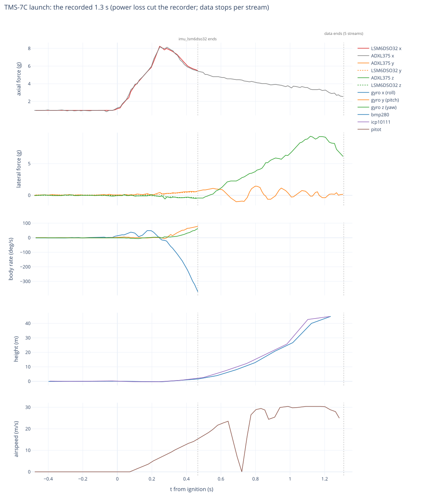
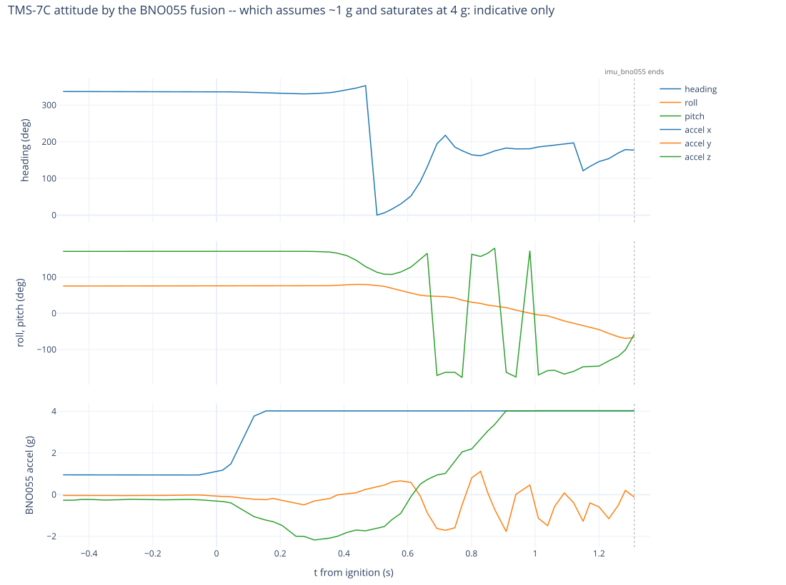

# TMS-7C — telemetry airframe

The instrumented flight. Built, calibrated and packed; see the fleet notes for its bring-up history.

| | |
|---|---|
| glider | **216.5 g** |
| booster | **98.9 g** |
| motor | **F15** (98.8 g loaded) |
| liftoff | **414.2 g** |
| wings | **ASE** |
| fins | **fixed at 0°** (the [7A](../TMS-7A/README.md) setting) |
| electronics | telemetry board, **no fin servos**, light power module |
| config | [`tms7c.config`](tms7c.config) — `concurrency: 1`, servos and control **disabled** |

Servos are absent and control is off, so the airframe is ballast under a fixed fin setting: this flight
buys sensor data, not guidance. That is why the fin angle is taken from the 7A/7B comparison rather than
chosen here — the instrumented flight should use a setting that has already flown.

At **216.5 g** it is lighter than the 235 g `f15_half` combo that landed 7 of 10 in the zone in
[`TMS-7-preflight`](../../../doc/sims/TMS-7-preflight/). That is encouraging for a later guided build on
this airframe, but it says nothing about this flight, which has no active control.

## Flight — 2026-10-03: lost boost stability, looped, crashed

The operator saw it fly off to the side, loop, and hit the ground in pieces, all within 5 s. The
recorder kept the first **1.31 s**. Those seconds rule out the motor and the electronics. The stack lost
its boost stability just off the rod, while the motor was still burning, and the data cannot say whether
low static margin or a built-in asymmetry started it.
This verdict comes from four independent analyses and an adversarial judge, each recomputing from the
data. The numbers below are the judge's.



| t from ignition | what the data shows |
|---|---|
| 0 → 0.25 s | normal F15: **8.25 g peak = 33.5 N**, the same spike TMS-7 measured (~33 N). It matches the 8.1 g that TMS-7's numbers predicted for this mass |
| to 0.285 s | clean on the rod: rotation ≤ 8 °/s, nose 3.4° off vertical; 1.0 m up at 10.6 m/s |
| **0.31 s** | **departure**: rotation starts and never reverses, 23 → 101 → 189 → 258 °/s by 1.07 s |
| 0.31–0.47 s | roll −59 → −372 °/s, driven by a roll torque **proportional to dynamic pressure** (−11.7 °/s² per Pa): a built-in asymmetry |
| 0.47–1.31 s | sideways load up to **9.3 g (≈35 N)** along the board's +z, an aerodynamic normal force at an angle of attack of tens of degrees; not spin, which the gyro caps at 0.5 g |
| ≈1.06 s | the nose passes **horizontal, still under thrust** |
| 1.31 s | last data on the card: still on the burning booster (+2.5 g axial), nose **74° below horizontal**, ~20 m up |
| ≈2.0–2.4 s | impact under power at ~45–55 m/s, 25–45 m from the pad (extrapolated, low confidence) |

**The cause.** Fins at 0° rule out a fin setting. The roll torque still had to come from somewhere: fin
setting error or play, the folded wings, the glider-to-booster seat, or the booster fins. The static
margin, estimated from the geometry, is **+0.24 calibers (−0.42 to +0.93)**, far below the 1–2 a stack
needs. Inadequate margin made worse by an asymmetry is the most likely mechanism (medium confidence).
Which one dominated is undecidable from 1.3 s of data.

**Instruments at large angles of attack.** The bay baros over-read once the airflow went sideways, to
45 m against a hard ceiling of 34 m. The pitot lost its flow at 0.69–0.75 s. The BNO055's fused angles
are usable only for nose elevation, cross-checked against the gyro; its roll sat near the Euler
singularity on the pad.



### Why the recording stops at 1.31 s

What is measured:
- **Writes reach the page cache, not the card.** The Luckfox recorder (`src/camera/recorded/recorderd.cpp`)
  writes each line with `fopen`/`fwrite`/`fclose`. That hands the line to the kernel's page cache, not
  to the card: nothing syncs. `/userdata` is ext4 `rw,relatime`, with writeback every 5 s and dirty
  data held up to 30 s.
- **`recorder.log` is buffered in the program,** flushed every 1000 lines. Its last lines, from 2.4 s
  before ignition on, were lost.
- **The UART link was losing data:** thousands of corrupted file names, and three LSM6DSO32 rows from 0.53,
  0.87 and 1.07 s found mangled into other streams' files. So the controller was still sampling at 1.07 s.
- **One common stop:** apart from the LSM6DSO32 and the sporadic laser, every stream is consistent with a
  single stop at about 1.31 s. The sequencer's event file is 0 bytes.

What it does not settle is what stopped at 1.31 s:
- writes still in the page cache, lost when the crash cut the power;
- a recorder that could not keep up.

**The operator's reading is the second.** Off USB the Luckfox also records 2304×1296 MJPEG video, and
video plus logging is more than it handles. On the bench, adb disables the video, so the problem never
shows there. Before launch the video was distorted with the camera facing the sun.

**The plan for the next flight:**
1. **No video on the recorder.**
2. **A ~2000 µF hold-up capacitor.** At ~0.5 W that rides through ~20 ms: connector bounce and brownouts
   under the boost loads. It saves buffered data only if a power-fail signal triggers a `sync` within
   that time.
3. **A new file organization for the recorder.**

Acceptance test: pull the power while the recorder logs, and count what is missing.

### Before December: validating the re-used hardware

In order:
1. **LiPo:** retire it on any dent or swelling; measure voltage and internal resistance.
2. **Inspect under a magnifier:** the v0.1 hand-jumpers, the joints on heavy parts, connectors, ceramic
   capacitors, the BNO055, pitot and laser breakouts, and the Luckfox with its SD socket.
3. **First power-up:** on a current-limited supply; compare the current draw with before the flight.
4. **Probe every device:** check the IDs against the pre-flight log in `recorder/board.log`.
5. **60 s static capture against the pre-flight medians:**

   | | pre-flight median |
   |---|---|
   | LSM6DSO32 | (0.984, 0.058, −0.006) g |
   | LSM6DSO32 gyro bias | (0.33, 0.02, −0.39) °/s |
   | ADXL375 | (1.764, 0.294, −0.049) g |
   | BMP280 − ICP-10111 | +317 Pa |
   | laser | 0.025 m |

   The ADXL375's +0.78 g offset and the 317 Pa baro split were there **before** the flight; they are not
   crash damage.
6. **Calibration:** a six-position accelerometer tumble, and a gyro scale check on a jig (±2 %).
7. **BNO055:** recalibrate it and save the profile again.
8. **Pitot:** leak-test the tubing and calibrate its span. On the boost it read only 0.6–0.7 of the
   inertial dynamic pressure.
9. **The rest:** the separation switch; GNSS outdoors, on battery.
10. **Soak:** 30 min with tapping or vibration while logging.
11. **Recorder:** the power-pull test above.

**The airframe, before another stack flies:**
- **Stability:** measure the stack's CG as flown and swing-test it in both planes. Go only at ≥ 1.5–2
  calibers. If it falls short, enlarge the booster fins (the estimate says 1.6–1.75× the semi-span) or
  fair the folded wings.
- **Asymmetry:** jig the fins to 0 ± 0.25° and pin them; check the folded wings for symmetry; key the
  sleeve against rotation. The glider sat 1.36° off the thrust axis on the rod.
- **A longer rod:** 2 m gives ~15 m/s at exit.
- **The simulator** flies the boost with a restoring-only weathercock and no roll axis, so it cannot
  produce this failure. It needs a 6-degree-of-freedom boost with margin per plane, a q-proportional roll
  asymmetry and the measured F15 curve, plus a regression that replays 7C and must depart.

**Open questions that would sharpen the verdict:** is there video? Did 7A fly straight on the same
wings and fins? Which way does the board's +z point relative to the wing plane? What was the wind? What did
the wreck show (fins' angle and play, wings unfolded, the sleeve joint)?

### The data

| | |
|---|---|
| [`recorder/`](recorder/) | the **original lines**, verbatim, from 30 s before ignition to the end of each stream, plus the session's `board.log` |
| [`flight/`](flight/) | the same rows with named columns, **t_s = 0 at ignition** (uptime 884.028860 s); units as recorded: LSM gyro in centi-°/s, BNO055 roll and pitch in centi-°, pitot fixnums ×100 |
| [`plots/`](plots/) | the two figures above, plus [`flight.html`](plots/flight.html) interactive |

The session is `20000101_000006_898573`. The board's clock was unset, so it is named for 2000-01-01;
the launch was found by its boost, not its date. The full recorder dump (5568 files) is kept off-repo.
Regenerate the data and the figures with:

```
python3 tools/recorder_flight.py <dump>/recordings --session 20000101_000006_898573 -o launches/20261003/TMS-7C
~/.local/share/pipx/venvs/plotly/bin/python tools/recorder_flight_plots.py launches/20261003/TMS-7C
```
