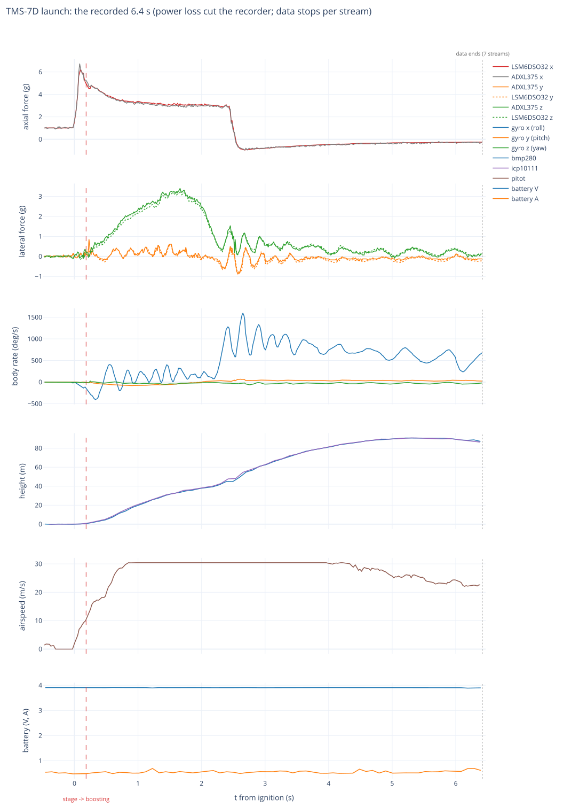
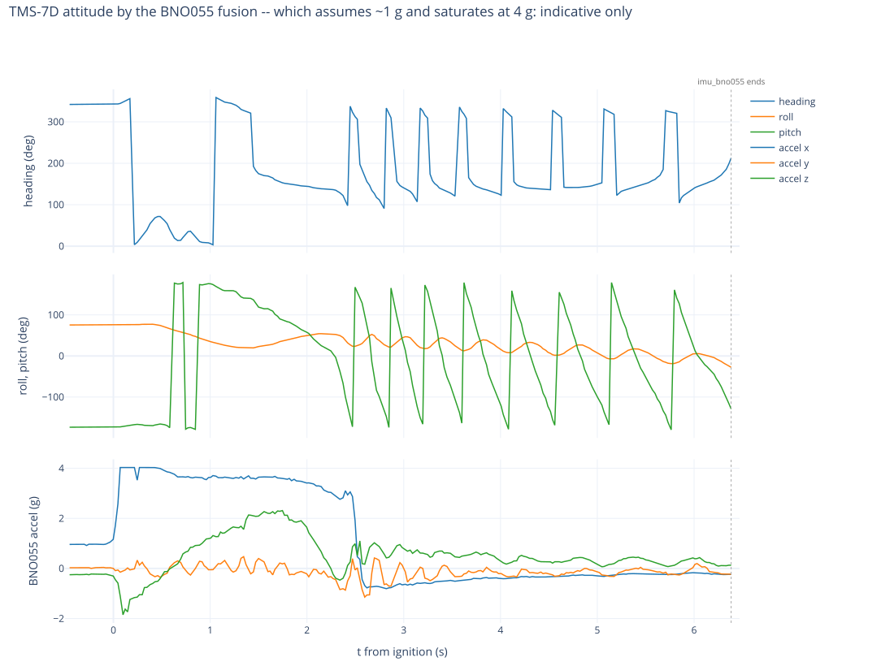

# TMS-7D — servo airframe

The long glider: three SG90 fin servos and the full power module.

| | |
|---|---|
| glider | **287.5 g** |
| booster | **97.9 g** |
| motor | **F15** (98.8 g loaded) |
| liftoff | **484.2 g** |
| wings | **ASE** |
| fins | three **SG90** servos (yaw, left eleron, right eleron) |
| electronics | telemetry board + **full power module** |
| config | [`tms7d.config`](tms7d.config) — servos fitted, **control OFF**, `concurrency: 3` |
| also here | [`tms7d_control.config`](tms7d_control.config) — full active control; **nothing flies it yet** |

Flies with servos fitted and exercisable but **no active control**: fins move for `probe()` and operator
commands, never under a PID. So this launch tests the servo install and the power module in flight, not
guidance.

**This profile belongs on the flight power board.** Three SG90s slewing together draw ~4 A; a 4 V / 1 A
bench supply browns out. Installing it on a bench board that then boot-looped killed
`servo_eleron_right` outright. `concurrency` is NOT the protection: it gates `servo.move()` only, and
boot centring re-centres all three fins together at every boot whatever it says -- and the bench
default config enables the servos too. On the bench, **disable the servos** in the config. The boot
loop itself came from a 1000 ms watchdog; validation now refuses anything below 4000.

## The mass to be aware of

At **287.5 g** this is almost exactly the `f15_full` combo (285 g) from
[`TMS-7-preflight`](../../../doc/sims/TMS-7-preflight/), which over three runs landed a **88–91 m median
and 0 of 10 in the zone** — against 37–46 m and **7 of 10** for the same motor at 235 g.

Irrelevant to 2026-10-03, since control is off. It matters for the first guided flight: at this mass the
study says the endgame does not converge, and closing the gap means finding ~52 g.

## Bench checks, 2026-09-04

**Servo wiring confirmed.** Driven one fin at a time over CC (`update <fin> {"angle": N}`) with the
operator watching: `servo_yaw`, then `servo_eleron_left`, then `servo_eleron_right` each moved in turn
and alone. The pin map matches the physical connectors -- GPIO **26 yaw / 27 left / 32 right**, no
duplicates.

**Yaw sign, measured:** commanding **45 deg moves the yaw fin RIGHT**, so that command yields a turn to
the **left**. Recorded here because the mixer's `servo_yaw: {yaw: 1}` gain assumes a direction, and the
sign is a property of this airframe's horn and linkage rather than of the code.

Config installed: `tms7d.config`, verified byte-identical to the file in this folder. `verify` reports
**pass, 21 devices up, no problems**. Not yet ready, for two expected reasons: `flight` is disabled by
design, and the **BNO055 still needs its figure-8** (last read `sys 3 gyr 3 acc 1 mag 0`).

## Flight — 2026-10-03: bent over in a crosswind, never separated, dropped ~250 m out

The operator saw it go up, then fly roughly horizontally for ~300 m, and come down without separating:
7E did the same. The airframe fragmented, but the recorder's card survived, and it holds **6.4 s of
flight**.
This verdict comes from four independent analyses and an adversarial judge, each recomputing from the
data. The numbers below are the judge's.



**The motor and the electrics were normal, and nothing reset on the pad.** The motor gave 42.6 N·s with
burnout at 2.53 s; TMS-7 gave ~42 N·s and 2.68 s. The board reads 3.89–3.91 V and 0.5–0.7 A through the
flight. What looked like a reboot after 17.9 min on the rod is MicroPython's `ticks_us` wrapping at 2³⁰ µs.
Every stream carries straight across it, so this was one boot, powered **23.5 min** before ignition.

| t from ignition | what the data shows |
|---|---|
| 0.08 s | thrust spike: **6.7 g** (ADXL375) / 6.2 g (LSM6DSO32) ≈ 30 N, as TMS-7 predicted for this mass |
| **0.18 s** | **launch detected** (`boosting; launch \|a\|=5.1g dwell=100ms`), the one sequencer row that survived |
| 0.25 s | 1 m of travel at only **9.0 m/s**. A crosswind of ~4.5 m/s (fitted) gives an angle of attack of ~26° |
| 0.4–1.2 s | the angle of attack **holds at 17–19°** while dynamic pressure rises 4×. The stack does not weathercock out of it, so its margin is near neutral early in the burn. Side load up to **3.6 g**. The nose goes **downwind** |
| 1.6 s | the flight path bottoms out at **32°** above horizontal; no loop, the rotation never passes 85 °/s |
| 1.4–2.2 s | the margin turns restoring as propellant burns. The angle of attack falls to 2°, and the path recovers to 37° |
| 2.2–2.65 s | the roll spins up to **1595 °/s** (80 % of the gyro's range) under thrust |
| 2.53 s | burnout at 53.5 m/s, 54 m up, 48 m out |
| 2.6–6.4 s | coast, with the roll proportional to speed (≈20 °/s per m/s). The drag stays constant (CdA ≈ 25 cm²): **no configuration change, no separation** |
| **5.3–5.5 s** | **apogee 91–98 m**, ~145 m out, still at 28 m/s |
| 6.42 s | last data on the card: 87–91 m up, descending at a 21° path, 28 m/s, still attached, no ejection signature |
| ≈10.0–10.6 s | impact, extrapolated: 246–258 m out at ~40 m/s, steep. It matches "~300 m, dropped" (medium confidence) |

**Why the glider did not separate cannot be decided.** The 3.6–4.2 s that would show it never reached
the card. What the data does establish:
- **No fixed motor delay fits this trajectory.** Apogee came only 2.9 s after burnout on this bent-over path,
  and would be 4.5–5.1 s on a vertical one. The one measured F15 delay is 5.8 s (TMS-7), and the stack
  never slowed below 27 m/s, so there was no gentle moment to separate in.
- **The board never saw a separation.** The separation pads read "nested" before flight, no edge was
  ever recorded, and the board stayed in BOOSTING to 5.44 s at least.
- **The mechanism is unproven at this mass.** It has never been shown to separate more than a 194 g
  glider; this one is 287.5 g. 7E failed too.

**Inputs for the separation redesign:**
- **Timing:** release from the board on a vertical speed ≤ 0, from fused baro and inertial data. Keep the
  motor charge only as a late backstop. Arm on a measured burnout, not a fixed 4 s.
- **Design for the conditions measured at release:** 27–34 m/s, paths from +40° to −55°, roll 500–1100 °/s.
- **The joint:** keyed and coaxial, with no roll play.
- **Energy:** prove ≥ 1.3 J at full glider mass, after a real burn.
- **Motor retention:** rated above the ejection force.
- **Logging:** the pin level in every checkpoint, and an "ejection kick" event separate from "separated".
- **No control on a stuck glider:** a GLIDING declared with the pin still nested must log "unseparated" and
  never engage control. `tms7d_control.config` would have engaged at ~6.85 s on an attached stack.



### 7C and 7D together

Both stacks share one weakness. The side force locked into the plane normal to the folded wings, the
margin sat at or below neutral early in the burn, and each carried a built-in roll asymmetry of about 1°
of equivalent fin cant.

**What differed was time, not design.** 7D's lower thrust-to-weight (4.5 g against 7.8 g at rod exit),
higher inertia and slightly further-forward CG slowed the divergence enough for the burning propellant to
move the CG forward and restore it. 7C ran out of time and looped.

**December needs:**
- **Margin:** a measured stack CG, swing-tested in both planes, with ≥ +1 caliber of effective margin at
  20° angle of attack. That is ~2–2.5 calibers on Barrowman's linear formula; 7D's nominal was 0.71, 7C's
  0.25.
- **Launch:** a 2–3 m rail, or a wind limit around a quarter of the rod-exit speed.
- **Asymmetry:** jig the fins and servo neutrals, and key the joint.
- **Simulator:** a 6-degree-of-freedom boost, with replay regressions of both flights. 7C must depart
  within 1.3 s; 7D must reproduce the 32° path minimum and a ~95 m apogee.

### Hardware and data notes

- **The uptime wraps every 17.9 min.** A pad dwell longer than that fakes a reset. The firmware should emit
  a non-wrapping timestamp; `tools/recorder_flight.py` now unwraps it.
- **The pad dwell cost** ~198 mAh, +2.7 m of baro zero drift and +8 °C on the MCU.
- **The OOM forecast is wrong in this build and in the current one.** It read `leak_kbps` 1 against a measured
  320–360 KB/s. It did not matter in this window.
- **The record ends at 6.42 s with every stream together, 3.6–4.2 s before the estimated impact.** It
  ends in the air, so whether the ejection charge fired is unknown. A video on the card, if the recorder
  took one, would decide it.
- **Re-use additions to the 7C checklist,** with every part treated as crash-loaded (~40 m/s impact):
  - re-check against these pre-flight medians:

    | | pre-flight median |
    |---|---|
    | LSM6DSO32 | (1.012, 0.010, 0.004) g |
    | LSM6DSO32 gyro bias | (−0.84, 0.35, −0.98) °/s |
    | ADXL375 | (1.764, 0.147, 0.196) g |
    | BMP280 − ICP-10111 | +114 Pa |
    | laser | 0.02 m |

  - check the LSM6DSO32 x-gyro scale on a rate jig (the coast fit prefers 0.98);
  - re-run the servo sweep, and compare its peak draw (4000/4125/2550 mW pre-flight) and the neutral pulses
    (1633/1455/1566 µs) on a jig. Replace the SG90 gear trains rather than trust them;
  - check the separation pads' continuity;
  - bench-test the INA226 ALERT path above 3 A;
  - check the LiPo's internal resistance (88–94 mΩ in flight, shunt included);
  - recalibrate the BNO055 (mag 0 before the flight);
  - calibrate the pitot's span (0.66–0.8 of the inertial dynamic pressure in the coast);
  - run a recorder power-pull test.

**Open questions that would sharpen the verdict:**
- Was there video on the recorder?
- In the wreck: was the spent casing still in the holder, was the delay burned through, was there soot on
  the glider's aft bulkhead, were the wings still folded?
- Did 7A and 7B separate?
- Was an ejection puff seen, and where?
- What were the rod length and the wind at launch?
- Which way does the board's +z point?

### The data

| | |
|---|---|
| [`recorder/`](recorder/) | the **original lines**, verbatim, from 270 s before ignition to the end of each stream, plus the session's `board.log` |
| [`flight/`](flight/) | the same rows with named columns, **t_s = 0 at ignition** (uptime 1409.087680 s, unwrapped across the 2³⁰ µs wrap). `;`-separated like the device; tokens as recorded; units as in TMS-7C |
| [`plots/`](plots/) | the two figures above, plus [`flight.html`](plots/flight.html) interactive |
| [`recorder_dump.tar.xz`](recorder_dump.tar.xz) | **the complete recorder dump** (4459 files, 75.8 MB unpacked). The card was cleaned after it was verified byte-identical, so this is the only copy |

The session is `20000101_000005_192721`. Regenerate the data and the figures with:

```
tar -xJf launches/20261003/TMS-7D/recorder_dump.tar.xz -C /tmp
python3 tools/recorder_flight.py /tmp/recordings --session 20000101_000005_192721 -o launches/20261003/TMS-7D --before 270
~/.local/share/pipx/venvs/plotly/bin/python tools/recorder_flight_plots.py launches/20261003/TMS-7D
```
